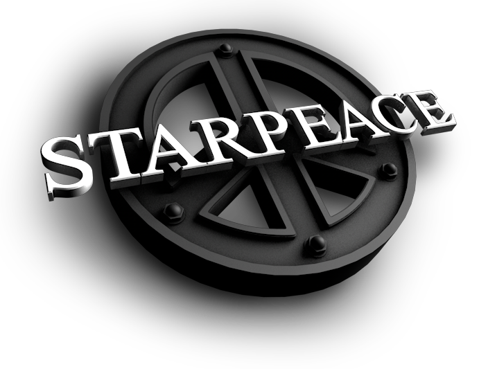

<!-- LOGO/ -->

<!-- /LOGO -->

<!-- TITLE/ -->
<h1>Starpeace Eloquent Models</h1>
<!-- /TITILE -->

<!-- DESCRIPTION/ -->
This is the repository for the Eloquent models used throughout the Starpeace Project, whether that be the API, the Controller, or elsewhere. 
<!-- /DESCRIPTION -->

<!-- INSTALL/ -->
        composer require starpeace-project/starpeace-eloquent-models
<!-- /INSTALL -->

<!-- HISTORY/ -->

<h2>History</h2>

<a href="https://github.com/starpeace-project/starpeace-lumen-api-interface/releases">Discover the release history by heading on over to the releases page.</a>

<!-- /HISTORY -->

<!-- BACKERS/ -->

<h2>Backers</h2>

<ul><li><a href="https://www.linkedin.com/in/rosswampler/">Ross Wampler</a></li></ul>

<h3>Maintainers</h3>

These amazing people are maintaining this project:

<ul><li><a href="https://www.linkedin.com/in/ron-appleton-b3066318/">Ron Appleton</a></li></ul>

<h3>Sponsors</h3>

No sponsors yet! Will you be the first?

<h3>Contributors</h3>

These amazing people have contributed code to this project:
<ul>
<li><a href="https://github.com/ronappleton">Ron Appleton</a> — <a href="https://github.com/starpeace-project/starpeace-lumen-api-interface/commits?author=ronappleton" title="View the GitHub contributions of Ron Appleton on repository starpeace-project/starpeace-lumen-api-interface">view contributions</a></li>
</ul>

<!-- /BACKERS -->

<!-- LICENSE/ -->

<h2>License</h2>

Unless stated otherwise all works are:

<ul><li>Copyright &copy; 2018 <a href="http://www.linkedin.com/in/ron-appleton-b3066318/">Ron Appleton</a></li></ul>

and licensed under:

<ul><li><a href="http://spdx.org/licenses/MIT.html">MIT License</a></li></ul>

<!-- /LICENSE -->